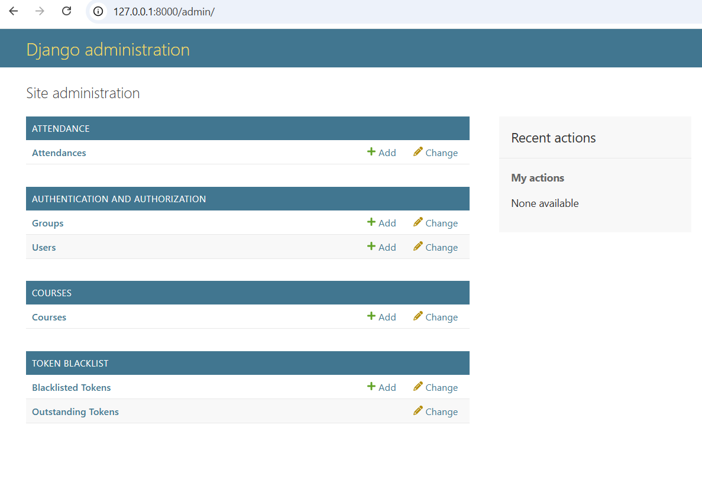
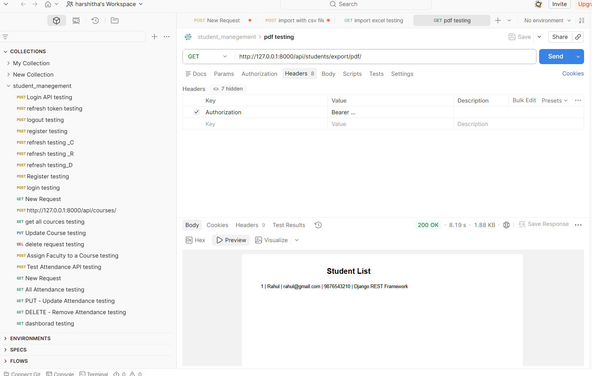

# 🎓 Student Management System

A full-stack **Student Management System** built using **Django**, **Django REST Framework**, and **JWT Authentication**. The application provides secure APIs for managing students, faculty, courses, attendance, dashboard statistics, audit logs, CSV import, and Excel/PDF export.

---

## 🚀 Features

- JWT Authentication (Register, Login, Refresh, Logout)
- Student Management (CRUD)
- Faculty Management (CRUD)
- Course Management (CRUD)
- Attendance Management
- Dashboard Statistics API
- Student Search
- Student Filtering
- CSV Bulk Import
- Excel Export
- PDF Export
- Audit Logging
- Serializer Validation
- PostgreSQL Database
- RESTful APIs

---

# 🛠 Tech Stack

### Backend

- Python
- Django
- Django REST Framework
- Simple JWT
- PostgreSQL

### Libraries

- django-filter
- pandas
- openpyxl
- reportlab
- pillow
- python-dotenv
- psycopg2-binary

---

# 📁 Project Structure

```
student_management/

│── accounts/
│── students/
│── faculty/
│── courses/
│── attendance/
│── dashboard/
│── auditlog/

│── student_management/
│── manage.py
│── requirements.txt
│── README.md
```

---

# ⚙ Installation

## Clone Repository

```bash
git clone https://github.com/your-username/student-management-system.git

cd student-management-system
```

---

## Create Virtual Environment

Windows

```bash
python -m venv venv

venv\Scripts\activate
```

Linux / Mac

```bash
python3 -m venv venv

source venv/bin/activate
```

---

## Install Dependencies

```bash
pip install -r requirements.txt
```

or

```bash
pip install django
pip install djangorestframework
pip install djangorestframework-simplejwt
pip install psycopg2-binary
pip install django-filter
pip install pandas
pip install openpyxl
pip install reportlab
pip install pillow
pip install python-dotenv
```

---

# 🗄 Database Setup

Create PostgreSQL database.

Update **settings.py**

```python
DATABASES = {
    "default": {
        "ENGINE": "django.db.backends.postgresql",
        "NAME": "student_management",
        "USER": "postgres",
        "PASSWORD": "your_password",
        "HOST": "localhost",
        "PORT": "5432",
    }
}
```

---

Run migrations

```bash
python manage.py makemigrations

python manage.py migrate
```

Create Super User

```bash
python manage.py createsuperuser
```

Run server

```bash
python manage.py runserver
```

---

# 🔐 Authentication APIs

| Method | Endpoint |
|---------|----------|
| POST | /api/register/ |
| POST | /api/login/ |
| POST | /api/token/refresh/ |
| POST | /api/logout/ |

Login returns

- Access Token
- Refresh Token

---

# 👨‍🎓 Student APIs

| Method | Endpoint |
|---------|----------|
| GET | /api/students/ |
| GET | /api/students/{id}/ |
| POST | /api/students/ |
| PUT | /api/students/{id}/ |
| DELETE | /api/students/{id}/ |

---

# 👨‍🏫 Faculty APIs

| Method | Endpoint |
|---------|----------|
| GET | /api/faculty/ |
| POST | /api/faculty/ |
| PUT | /api/faculty/{id}/ |
| DELETE | /api/faculty/{id}/ |

---

# 📚 Course APIs

| Method | Endpoint |
|---------|----------|
| GET | /api/courses/ |
| POST | /api/courses/ |
| PUT | /api/courses/{id}/ |
| DELETE | /api/courses/{id}/ |

Faculty can be assigned to multiple courses.

---

# 📅 Attendance APIs

| Method | Endpoint |
|---------|----------|
| GET | /api/attendance/ |
| POST | /api/attendance/ |
| PUT | /api/attendance/{id}/ |
| DELETE | /api/attendance/{id}/ |

Attendance Status

- Present
- Absent
- Leave

---

# 📊 Dashboard API

```
GET /api/dashboard/
```

Returns

- Total Students
- Total Faculty
- Total Courses
- Today's Attendance
- Recent Students

---

# 🔍 Search API

Search students by

- Name
- Email
- Phone

Example

```
GET /api/students/?search=Harshitha
```

---

# 🎯 Filter API

Filter students by Course

```
GET /api/students/?course=Python
```

Filter students by Faculty

```
GET /api/students/?faculty=John
```

Filter students by Gender

```
GET /api/students/?gender=Female
```

---

# ✅ Validation

Backend validation is implemented using Django REST Framework Serializers.

Includes

- Required Fields
- Email Validation
- Phone Validation
- Password Validation

---

# 📝 Audit Logs

Audit logs are automatically created for

- Student Created
- Student Updated
- Student Deleted

Each log stores

- User
- Action
- Table Name
- Record ID
- Timestamp

---

# 📥 Bulk Student Import

Upload CSV file

Example

```csv
Name,Email,Phone

Harshitha,harshitha@gmail.com,9876543210

Rahul,rahul@gmail.com,9988776655
```

API

```
POST /api/students/import/
```

Uses

- pandas

---

# 📤 Export Excel

API

```
GET /api/export/excel/
```

Uses

- openpyxl

---

# 📄 Export PDF

API

```
GET /api/export/pdf/
```

Uses

- reportlab

---

# 🗃 Database Models

## Student

- student_name
- email
- phone
- gender
- dob
- address
- course
- created_at
- updated_at

---

## Faculty

- faculty_name
- email
- phone
- department
- experience

---

## Course

- course_name
- duration
- fees
- faculty

---

## Attendance

- student
- date
- status

---

## Audit Log

- user
- action
- table_name
- record_id
- created_at

---

# 🔒 Authentication

Protected APIs require JWT Access Token.

Example

```
Authorization: Bearer <access_token>
```

---

# 📌 Future Improvements

- React Frontend
- Role-Based Access Control
- Swagger/OpenAPI Documentation
- Pagination
- Docker Support
- AWS Deployment
- Email Notifications
- Unit Testing
- CI/CD Pipeline

---

# 👩‍💻 Author

**Harshitha MB**

Python Backend Developer

GitHub: https://github.com/harshithamb02-cpu-Dhanu

LinkedIn: https://www.linkedin.com/in/harshitha-m-b-a642763b6/


Docker Deployemet 

git clone https://github.com/harshithamb02-cpu-Dhanu/student-management-system.git
cd student-management-system

docker compose build
docker compose up -d

docker compose exec web python manage.py migrate
docker compose exec web python manage.py createsuperuser

user name :admin
password : admin@123

After runing the port this are the screnshots




After Docker compose -up this are all logs

(venv) C:\Users\Manjunath\Desktop\project_practise\student_management>docker compose up --build
time="2026-07-09T13:35:29+05:30" level=warning msg="C:\\Users\\Manjunath\\Desktop\\project_practise\\student_management\\docker-compose.yml: the attribute `version` is obsolete, it will be ignored, please remove it to avoid potential confusion"
#1 [internal] load local bake definitions
#1 reading from stdin 597B done
#1 DONE 0.0s

#2 [internal] load build definition from Dockerfile
#2 transferring dockerfile: 534B 0.1s done
#2 DONE 0.1s

#3 [internal] load metadata for docker.io/library/python:3.12-slim
#3 DONE 2.2s

#4 [internal] load .dockerignore
#4 transferring context: 34B 0.0s done
#4 DONE 0.0s

#5 [1/5] FROM docker.io/library/python:3.12-slim@sha256:423ed6ab25b1921a477529254bfeeabf5855151dc2c3141699a1bfc852199fbf
#5 resolve docker.io/library/python:3.12-slim@sha256:423ed6ab25b1921a477529254bfeeabf5855151dc2c3141699a1bfc852199fbf 0.1s done
#5 DONE 0.1s

#6 [internal] load build context
#6 transferring context: 443.04kB 5.1s
#6 transferring context: 1.27MB 10.2s
#6 transferring context: 1.36MB 11.1s done
#6 DONE 11.4s

#7 [2/5] WORKDIR /app
#7 CACHED

#8 [3/5] COPY requirements.txt .
#8 CACHED

#9 [4/5] RUN pip install --no-cache-dir -r requirements.txt
#9 CACHED

#10 [5/5] COPY . .
#10 CACHED

#11 exporting to image
#11 exporting layers 0.0s done
#11 exporting manifest sha256:98046c9fc9990d91bc3ec64f183a5ff9111805c610b19f1810a57f081e0964f7 done
#11 exporting config sha256:935fbfe74b6f0dc3c7cfcd0429bbb5396ce12dca9ef0cac89058d8015c81ea1d done
#11 exporting attestation manifest sha256:9d1f0bdf5aaaf8e72cf9281ef42c075342f8a6cafeb9db65023cca60dc832709 0.1s done
#11 exporting manifest list sha256:53209cbe9628f81a9940f1d83037eb0f86b29eb28ae2ee46ad85c6b3226e7088
#11 exporting manifest list sha256:53209cbe9628f81a9940f1d83037eb0f86b29eb28ae2ee46ad85c6b3226e7088 0.0s done
#11 naming to docker.io/library/student_management-web:latest 0.0s done
#11 unpacking to docker.io/library/student_management-web:latest 0.0s done
#11 DONE 0.3s

#12 resolving provenance for metadata file
#12 DONE 0.2s
[+] up 2/2
 ✔ Image student_management-web       Built                                                                       16.3s
 ✔ Container student_management-web-1 Recreated                                                                    0.9s
Attaching to web-1
web-1  | Watching for file changes with StatReloader
web-1  | Performing system checks...
web-1  |
web-1  | System check identified no issues (0 silenced).
web-1  | July 09, 2026 - 08:05:58
web-1  | Django version 6.0.7, using settings 'student_management.settings'
web-1  | Starting development server at http://0.0.0.0:8000/
web-1  | Quit the server with CONTROL-C.
web-1  |
web-1  | WARNING: This is a development server. Do not use it in a production setting. Use a production WSGI or ASGI server instead.
web-1  | For more information on production servers see: https://docs.djangoproject.com/en/6.0/howto/deployment/
web-1 has been recreated
web-1 exited with code 137
web-1  | Watching for file changes with StatReloader
web-1  | Performing system checks...
web-1  |  Docker Desktop   o View Config   w Enable Watch   d Detach
web-1  | System check identified no issues (0 silenced).
web-1  | July 09, 2026 - 08:26:17
web-1  | Django version 6.0.7, using settings 'student_management.settings'
web-1  | Starting development server at http://0.0.0.0:8000/
web-1  | Quit the server with CONTROL-C.
web-1  |
web-1  | WARNING: This is a development server. Do not use it in a production setting. Use a production WSGI or ASGI server instead.
web-1  | For more information on production servers see: https://docs.djangoproject.com/en/6.0/howto/deployment/
web-1  | Not Found: /
web-1  | [09/Jul/2026 08:26:22] "GET / HTTP/1.1" 404 2325
web-1  | Not Found: /favicon.ico
web-1  | [09/Jul/2026 08:26:23] "GET /favicon.ico HTTP/1.1" 404 2376
web-1  | Not Found: /
web-1  | [09/Jul/2026 08:27:29] "GET / HTTP/1.1" 404 2325
web-1  | Not Found: /favicon.ico
web-1  | [09/Jul/2026 08:27:29] "GET /favicon.ico HTTP/1.1" 404 2376
web-1  | [09/Jul/2026 08:38:11] "GET /admin/ HTTP/1.1" 302 0
web-1  | [09/Jul/2026 08:38:12] "GET /admin/login/?next=/admin/ HTTP/1.1" 200 4080
web-1  | [09/Jul/2026 08:38:12] "GET /static/admin/css/nav_sidebar.css HTTP/1.1" 200 2810
web-1  | [09/Jul/2026 08:38:12] "GET /static/admin/css/base.css HTTP/1.1" 200 23100
web-1  | [09/Jul/2026 08:38:12] "GET /static/admin/css/login.css HTTP/1.1" 200 951
web-1  | [09/Jul/2026 08:38:12] "GET /static/admin/css/responsive.css HTTP/1.1" 200 16273
web-1  | [09/Jul/2026 08:38:12] "GET /static/admin/css/dark_mode.css HTTP/1.1" 200 3538
web-1  | [09/Jul/2026 08:38:12] "GET /static/admin/js/theme.js HTTP/1.1" 200 1653
web-1  | [09/Jul/2026 08:38:12] "GET /static/admin/js/nav_sidebar.js HTTP/1.1" 200 3063
web-1  | Not Found: /api/students/
web-1  | [09/Jul/2026 08:38:30] "GET /api/students/ HTTP/1.1" 404 2782
web-1  | [09/Jul/2026 08:38:43] "GET /admin/login/?next=/admin/ HTTP/1.1" 200 4080
web-1  | [09/Jul/2026 08:40:27] "POST /admin/login/?next=/admin/ HTTP/1.1" 302 0
web-1  | [09/Jul/2026 08:40:28] "GET /admin/ HTTP/1.1" 200 10015
web-1  | [09/Jul/2026 08:40:28] "GET /static/admin/css/dashboard.css HTTP/1.1" 200 441
web-1  | [09/Jul/2026 08:40:28] "GET /static/admin/img/icon-addlink.svg HTTP/1.1" 200 593
web-1  | [09/Jul/2026 08:40:29] "GET /static/admin/img/icon-changelink.svg HTTP/1.1" 200 978
web-1  | [09/Jul/2026 08:42:07] "GET /admin/attendance/attendance/ HTTP/1.1" 200 14408
web-1  | [09/Jul/2026 08:42:07] "GET /static/admin/js/jquery.init.js HTTP/1.1" 200 347
web-1  | [09/Jul/2026 08:42:07] "GET /static/admin/js/core.js HTTP/1.1" 200 6208
web-1  | [09/Jul/2026 08:42:07] "GET /static/admin/js/admin/RelatedObjectLookups.js HTTP/1.1" 200 9777
web-1  | [09/Jul/2026 08:42:07] "GET /static/admin/css/changelists.css HTTP/1.1" 200 7498
web-1  | [09/Jul/2026 08:42:07] "GET /static/admin/css/base.css HTTP/1.1" 304 0
web-1  | [09/Jul/2026 08:42:07] "GET /static/admin/css/responsive.css HTTP/1.1" 304 0
web-1  | [09/Jul/2026 08:42:07] "GET /static/admin/css/dark_mode.css HTTP/1.1" 304 0
web-1  | [09/Jul/2026 08:42:07] "GET /static/admin/css/nav_sidebar.css HTTP/1.1" 304 0
web-1  | [09/Jul/2026 08:42:07] "GET /static/admin/js/actions.js HTTP/1.1" 200 8077
web-1  | [09/Jul/2026 08:42:07] "GET /static/admin/js/urlify.js HTTP/1.1" 200 7887
web-1  | [09/Jul/2026 08:42:07] "GET /static/admin/js/prepopulate.js HTTP/1.1" 200 1531
web-1  | [09/Jul/2026 08:42:07] "GET /static/admin/js/vendor/jquery/jquery.js HTTP/1.1" 200 285314
web-1  | [09/Jul/2026 08:42:07] "GET /static/admin/js/theme.js HTTP/1.1" 304 0
web-1  | [09/Jul/2026 08:42:07] "GET /admin/jsi18n/ HTTP/1.1" 200 3342
web-1  | [09/Jul/2026 08:42:07] "GET /static/admin/js/vendor/xregexp/xregexp.js HTTP/1.1" 200 325171
web-1  | [09/Jul/2026 08:42:09] "GET /static/admin/img/search.svg HTTP/1.1" 200 607
web-1  | [09/Jul/2026 08:42:09] "GET /static/admin/js/nav_sidebar.js HTTP/1.1" 304 0
web-1  | [09/Jul/2026 08:42:09] "GET /static/admin/js/filters.js HTTP/1.1" 200 978
web-1  | [09/Jul/2026 08:42:09] "GET /static/admin/img/icon-viewlink.svg HTTP/1.1" 200 928
web-1  | [09/Jul/2026 08:42:09] "GET /static/admin/img/tooltag-add.svg HTTP/1.1" 200 593
web-1  | [09/Jul/2026 08:42:30] "GET /admin/auth/group/ HTTP/1.1" 200 11235
web-1  | [09/Jul/2026 08:42:30] "GET /admin/jsi18n/ HTTP/1.1" 200 3342
web-1  | [09/Jul/2026 08:42:34] "GET /admin/attendance/attendance/ HTTP/1.1" 200 14408
web-1  | [09/Jul/2026 08:42:34] "GET /admin/jsi18n/ HTTP/1.1" 200 3342
web-1  | [09/Jul/2026 08:42:36] "GET /admin/auth/user/ HTTP/1.1" 200 15768
web-1  | [09/Jul/2026 08:42:36] "GET /static/admin/img/icon-yes.svg HTTP/1.1" 200 558
web-1  | [09/Jul/2026 08:42:36] "GET /static/admin/img/icon-no.svg HTTP/1.1" 200 645
web-1  | [09/Jul/2026 08:42:36] "GET /admin/jsi18n/ HTTP/1.1" 200 3342
web-1  | [09/Jul/2026 08:42:36] "GET /static/admin/img/sorting-icons.svg HTTP/1.1" 200 1761
web-1  | [09/Jul/2026 08:42:51] "GET /admin/attendance/attendance/ HTTP/1.1" 200 14408
web-1  | [09/Jul/2026 08:42:51] "GET /admin/jsi18n/ HTTP/1.1" 200 3342
web-1  | [09/Jul/2026 08:43:03] "GET /admin/ HTTP/1.1" 200 10015
web-1  | [09/Jul/2026 08:43:06] "GET /admin/courses/course/ HTTP/1.1" 200 12847
web-1  | [09/Jul/2026 08:43:06] "GET /admin/jsi18n/ HTTP/1.1" 200 3342
web-1  | [09/Jul/2026 08:43:11] "GET /admin/token_blacklist/blacklistedtoken/ HTTP/1.1" 200 13851
web-1  | [09/Jul/2026 08:43:11] "GET /admin/jsi18n/ HTTP/1.1" 200 3342
web-1  | [09/Jul/2026 08:43:16] "GET /admin/token_blacklist/outstandingtoken/ HTTP/1.1" 200 17644
web-1  | [09/Jul/2026 08:43:24] "GET /admin/attendance/attendance/ HTTP/1.1" 200 14408
web-1  | [09/Jul/2026 08:43:24] "GET /admin/jsi18n/ HTTP/1.1" 200 3342
web-1  | [09/Jul/2026 08:43:28] "GET /admin/ HTTP/1.1" 200 10015
web-1  | [09/Jul/2026 09:09:49] "GET /api/students/export/pdf/ HTTP/1.1" 200 1595
